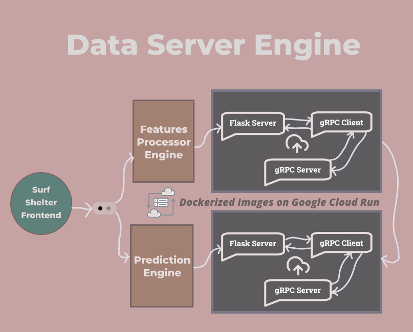
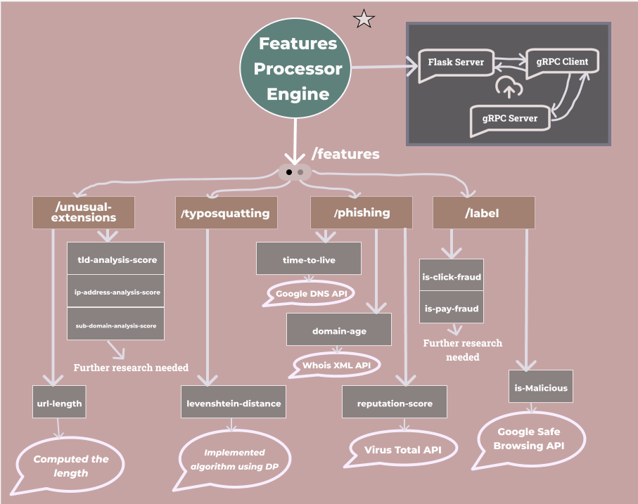
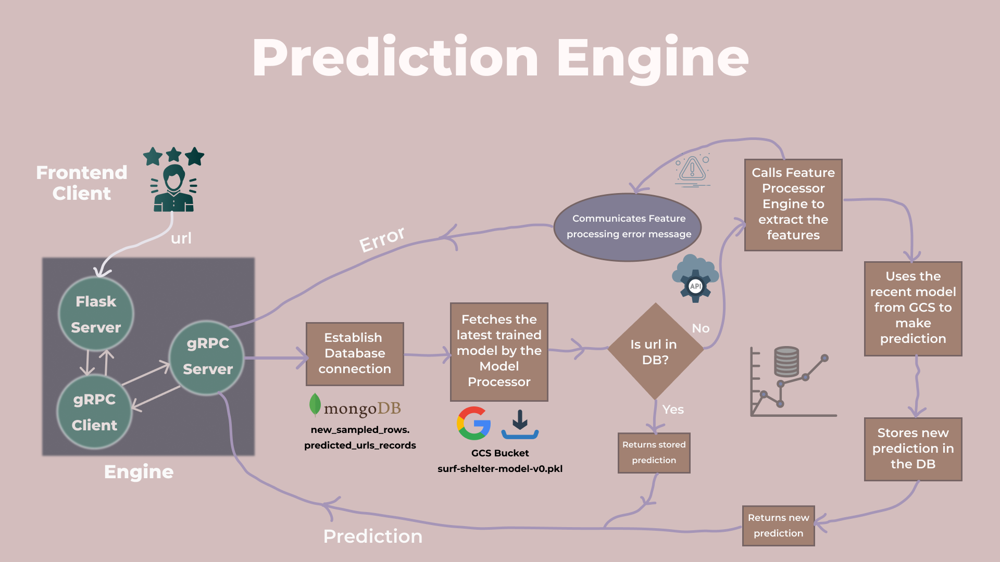
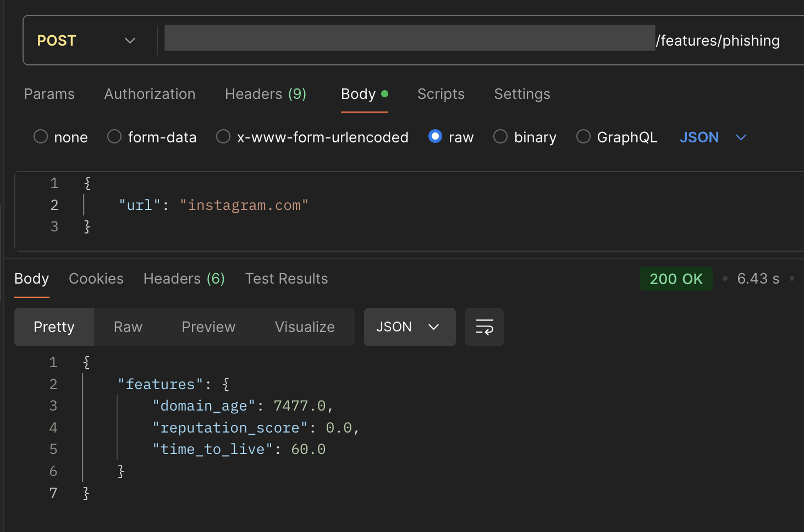
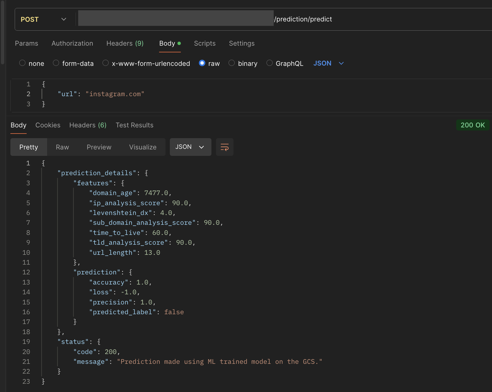

# Surf Shelter Data Processor Engine

The Data Server Engine bridges the gap between the [frontend](https://github.com/KarkiAdit/surf-shelter-frontend-client-engine/blob/main/readme.md) and [model processing](https://github.com/KarkiAdit/surf-shelter-model-processor-engine/blob/master/Readme.md), streamlining feature extraction and prediction.

## 🔍 Overview

The Data Server Engine is a **multithreaded application** that integrates a **Flask-based API service** with an internal **gRPC server**. It handles gRPC requests through two core microservices:
- **Features Processor Engine**
- **Prediction Engine**

**Key Highlights:**
- Internal communication flow: `Flask App → gRPC Client → gRPC Server`
- Fully containerized using **Docker** and deployed on **Google Cloud Run**, ensuring scalability and structured API endpoints.
- Facilitates seamless data flow and high-performance processing.

## ✨ Features

- **Endpoints**:
  - `/typosquatting`: Detects domain manipulation using Levenshtein Distance.
  - `/phishing`: Flags phishing attempts by analyzing attributes like TTL, Domain Age, and Reputation Score.
  - `/unusual-ext`: Identifies suspicious domain extensions based on URL and domain analysis.
  - `/label`: Classifies URLs as malicious or safe using **Google's Safe Browsing API**.
  - `/predict`: Provides a prediction on whether the given URL is malicious or safe, based on key extracted features.

- **Dynamic Feature Extraction**:
  - Implements algorithms (e.g., dynamic programming, pattern recognition).
  - Integrates external APIs like Google DNS-over-HTTPS, WhoisXML, VirusTotal, and Google's Safe Browsing.

- **Prediction Engine**:
  - Utilizes the latest trained ML model for URL safety predictions.
  - Populates `predicted_urls_records`, the database table tracking recent predictions.

## 🗂️ High-Level Design

Below are diagrams illustrating the architecture:

1. **Data Server Engine Architecture**  
   

2. **Features Processor Engine Workflow**  
   

3. **Prediction Engine Workflow**  
   

## 🎥 Demo

Below is a demo response on Postman for the fully deployed Data Server Engine using `instagram.com`:

- **Features Processor Engine (/features/phishing)**:
   

- **Prediction Engine (/prediction/predict)**:
   

## ⚙️ Developer Setup

Follow these steps to set up and deploy the Data Server Engine:

1. Generate Python Classes from Protobuf:
```bash
python -m grpc_tools.protoc -I=protos --python_out=generated \
 --grpc_python_out=generated protos/<your_proto_file>.proto
```

2. Build and Run Docker Image:
```bash
docker buildx build --platform linux/amd64 -t <your_image_name>:<tag> .
```

```bash
docker run -p <external_port>:<internal_port> -p <external_grpc_port>:<internal_grpc_port> \
 -e ENV_VAR_1=<value_1> -e ENV_VAR_2=<value_2> <your_image_name>:<tag>
```
3. Set Up Google Cloud Environment:
- Authenticate and create a project
```bash
gcloud auth login
gcloud projects create <your_project_id>
gcloud config set project <your_project_id>
```

- Enable services
```bash
gcloud services enable run.googleapis.com artifactregistry.googleapis.com
```

4. Push Docker Image to Artifact Registry:
```bash
gcloud artifacts repositories create <your_repo_name> --repository-format=Docker --location=us-central1

docker tag <your_image_name>:<tag> us-central1-docker.pkg.dev/<your_project_id>/<your_repo_name>/<your_image_name>:<tag>

docker push us-central1-docker.pkg.dev/<your_project_id>/<your_repo_name>/<your_image_name>:<tag>
```

5. Deploy to Google Cloud Run:
```bash
gcloud run deploy <your_service_name> 
--image=us-central1-docker.pkg.dev/<your_project_id>/<your_repo_name>/<your_image_name>:<tag> \
--platform=managed \
--region=us-central1 --allow-unauthenticated \
--set-env-vars ENV_VAR_1=<value_1>,ENV_VAR_2=<value_2>
```

## 🧑‍💻 Technologies Used
- **Programming Languages**: Python
- **Frameworks**: Flask
- **RPC Framework**: grpcio, grpcio-tools, protobuf
- **Machine Learning**: scikit-learn, joblib, numpy, pandas
- **Database**: pymongo
- **Cloud Services**: Google Cloud Storage, Google Cloud Run
- **HTTP Requests**: requests
- **Containerization**: Docker

## 🤝 Contributing
Contributions are welcome! To contribute:

Fork the Repository: ***Click the Fork button on GitHub.***


Clone the Repository:

```bash
git clone https://github.com/<your_username>/<repo_name>.git
```
Create a Branch:

```bash
git checkout -b <branch_name>
Make Changes: Implement changes and ensure code quality.
```

Test Your Changes: ***Verify functionality locally.***

Submit a Pull Request: ***Push changes to your branch and open a pull request on GitHub.***

## 📚 Acknowledgments
[Flask App Serving](https://flask.palletsprojects.com/en/stable/lifecycle/#serving-the-application)<br>
[gRPC Docs](https://cloud.google.com/run/docs/triggering/grpc)<br>
[Google Cloud Run Documentation](https://cloud.google.com/run/docs/quickstarts/build-and-deploy/deploy-python-service)<br>
[SVC Prediction](https://scikit-learn.org/dev/modules/generated/sklearn.svm.SVC.html)<br>
[Docker Documentation](https://docs.docker.com/get-started/docker-concepts/building-images/)

