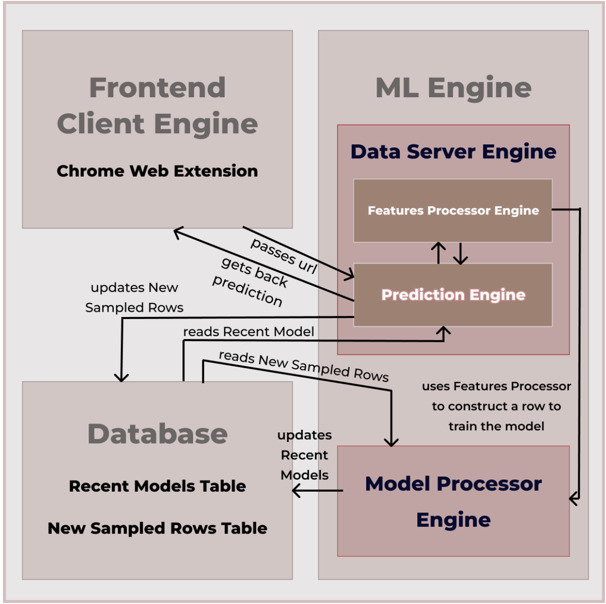

# 🚀 Data Server Engine

The **Data Server Engine** is a middleware component designed to facilitate communication between the **Frontend Client** and the **Model Processor**. It is built as a Flask API service, also capable of handling gRPC requests internally, and consists of two main microservices:

- **Features Processor Engine**
- **Prediction Engine**

This project is designed to be scalable, modular, and cloud-ready, hosted on **Google Cloud Run** using Dockerized images for each microservice.

---

## 📁 Project Structure

```
/data-server-engine
    /features-processor-engine
        ├── app/
            ├── __init__.py
            ├── routes.py
            ├── utils.py
        ├── grpc_service/
            ├── features.proto
            ├── features_pb2.py
            ├── features_pb2_grpc.py
            ├── grpc_server.py
            ├── grpc_client.py
        ├── .dockerignore
        ├── Dockerfile
        ├── requirements.txt
        └── main.py
    /prediction-engine
        ├── app/
            ├── __init__.py
            ├── routes.py
            ├── utils.py
        ├── grpc_service/
            ├── features.proto
            ├── features_pb2.py
            ├── features_pb2_grpc.py
            ├── grpc_server.py
            ├── grpc_client.py
        ├── .dockerignore
        ├── Dockerfile
        ├── requirements.txt
        └── main.py
    ├── .gitignore
    └── README.md
```

---

## Features Processor Engine

The **Features Processor Engine** is a Flask microservice responsible for generating numerical values for each feature used to build the ML model. It plays a crucial role in extracting features from URLs and constructing the training set.

### How It Works

1. **URL Analysis**: Extracts and computes numerical features from a given URL.
2. **Label Generation**: Assigns labels to URLs using reputation score from a public API.
3. **Integration**: These features and labels are passed to the **Prediction Engine** for making predictions.

---

## Prediction Engine

The **Prediction Engine** is a Flask microservice that generates predictions using the latest trained models. It works in coordination with the Features Processor Engine and provides streamlined prediction services.

### How It Works

1. **Feature Gathering**: Requests features from the **Features Processor Engine**.
2. **Prediction**: Uses the recent ML models to generate predictions for provided URL.
3. **Data Storage**: Updates the database with both feature data and prediction results for further analysis.

---

## Deployment on Google Cloud Run

The Data Server Engine is designed to be hosted on **Google Cloud Run**, with Dockerized images for each microservice.

- **Dockerized Deployment**: Each microservice runs in a separate container.
- **Cloud-Ready**: Deployed using CI/CD pipelines to ensure seamless integration and continuous delivery.

### 🚀 Getting Started

#### 1. Prerequisites

Ensure you have the following installed:

- 🐍 Python 3.8+
- 📦 Docker
- ☁️ Google Cloud SDK

#### 2. Installation

1. **Clone the repository**:

   ```bash
   git clone https://github.com/your-username/data-server-engine.git
   cd data-server-engine
   ```

2. **Install dependencies**:

   ```bash
   pip install -r requirements.txt
   ```

#### 3. Building and Deploying with Docker

1. **Build the Docker image**:

   ```bash
   docker build -t data-server-engine/features-processor-engine .
   docker build -t data-server-engine/prediction-engine .
   ```

2. **Run the Docker container**:

   ```bash
   docker run -p 5001:5001 -p 50051:50051 data-server-engine/features-processor-engine
   docker run -p 5001:5001 -p 50051:50051 data-server-engine/prediction-engine
   ```

---

## 📖 API Endpoints

### Features Processor Engine Endpoints

- `/features/unusual-extensions` - Generate features for unusual extensions
- `/features/typosquatting` - Generate features for typosquatting detection
- `/features/phishing` - Generate features for phishing detection
- `/features/label` - Generate labels for URLs

### Prediction Engine Endpoint

- `/prediction/predict` - Generate a prediction using the trained model

---

## 🛠 Tech Stack

- **Programming Language**: Python
- **Backend Framework**: Flask
- **Inter-Service Communication**: Flask, gRPC
- **Containerization**: Docker
- **Hosting**: Google Cloud Run

---

## 📚 Resources

- [Flask Documentation](https://flask.palletsprojects.com/)
- [gRPC Documentation](https://grpc.io/docs/)
- [Google Cloud Run](https://cloud.google.com/run/docs)

---

## 👥 Contributors

- **Aditya Karki** - [GitHub Profile](https://github.com/karkiadit)

---

## 🤝 Contributing

Contributions, issues, and feature requests are welcome! Feel free to check out the [issues page](https://github.com/karkiadit/data-server-engine/issues).

---

## 📊 Architecture Diagram



The diagram shows the architecture of the **Data Server Engine**, detailing how the **Features Processor Engine** and **Prediction Engine** interact with the **Database**, **Frontend Client Engine** and **Model Processor Engine**.

---
